# Hangman Game
Hangman is a word game where the goal is simply to find the missing word or words. 
You will be presented with a number of blank spaces representing the missing letters you need to find.

View live site here! <a href="https://myfirst-hangman-game.herokuapp.com/">link</a>

 
## Table of content

- [Hangman Game](#hangman-game)
  * [Table of content](#table-of-content)
  * [UX](#ux)
      - [User Stories](#user-stories)
      - [Returning users](#returning-users)
      - [Site owner](#site-owner)
      - [Site structure](#site-structure)
  * [Features](#features)
  * [Technologies Used](#technologies-used)
  * [Validator Testing](#validator-testing)
  * [Manual testing](#manual-testing)
  * [Deployment](#deployment)
      - [Project deployment steps below](#project-deployment-steps-below)
  * [Forking a Repository](#forking-a-repository)
  * [Cloning a Repository**](#cloning-a-repository--)
  * [Unfixed bugs](#unfixed-bugs)
  * [Credits and Reference](#credits-and-reference)
  * [Acknowledgements](#acknowledgements)
  

## UX

#### User Stories
First time users
- As a user I want enjoy playing word game.
- As a user I wants to have clear feedback for their action
- As a user I want to navigate to pages easily 
- As a user I want to play and get appropriate message based on game progress 
- As a user I want the site to be intuitive looking
- As a user I want to know how to select different level of game
- As a user I want to see visual effect of the game 

#### Returning users

- As a returning user of the site, I want to be able to quickly find information about game 
- As a returning user of the site, I want to be able to quickly start the game 

#### Site owner

- As an owner of the site, I want to let people enjoy the game  
- As an owner of the site, I want to give options for different levels of game 
- As an owner of the site, I want the game easily available for new user.
- As an owner of the site, I want to display the game progress for each user input 
- As an owner of the site, I want the game site to be easily navigating and functioning  

#### Site structure

- The home page will have a main banner with large ascii art image of main title.
- Use the keyboard to guess a letter
- The chosen letter exists in the answer, then all places in the answer where
  that letter appear will be revealed.
- Every wrong letter entry user loose a life and the hangman begins to appear
- Word should be guessed before hangman dies or user will loose all chances.
- After loosing all chance or winning the game, user will be asked for replay or exit the game.
 

**Structure**
The flowchart made during the planning stage of the project. The detalied flowchart shows the structure of the game plan and it was helpful for the difeerent stages of development of the game.   

Flowchart
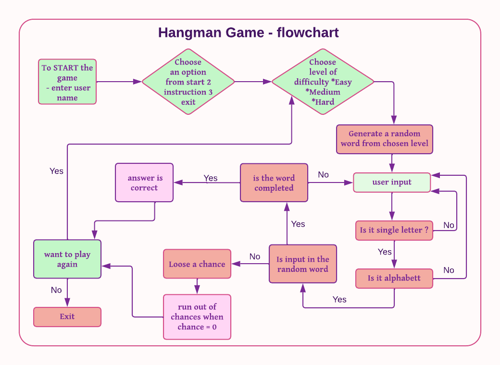

## Features

- welcome message with user name
- user can choose from start, instructions or exit
- user can select different level of game
- user can see the graphical representaion of a hangman
  throughout the game 
- user can choose restart the game or exit the game 

- **Game plan**
- Upon loading the page, a large logo ascii art displays and asks
  the user to input their name.

   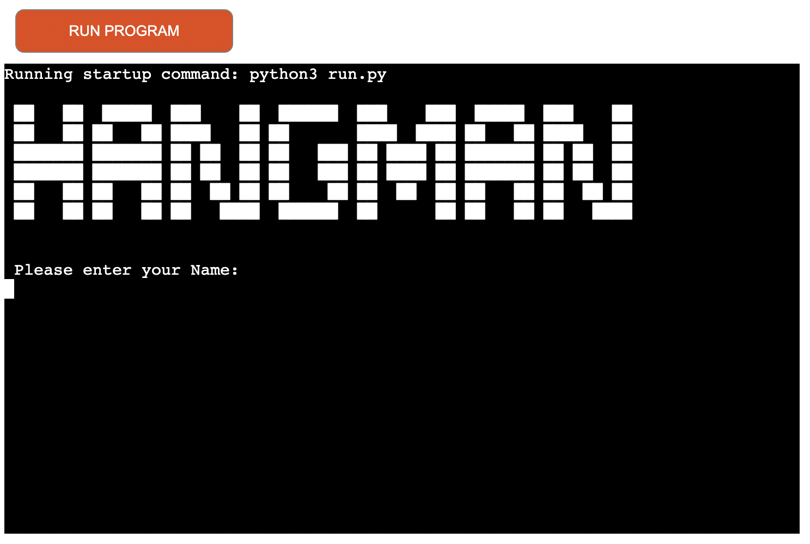 

- It's important to give a input, user can enter any letters. When the user completes
  entering their name, a welcome message with their name appears.
  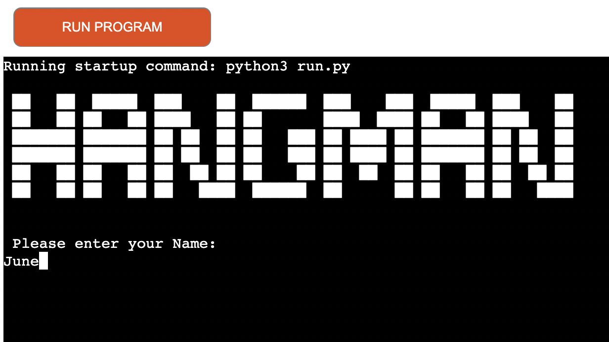
  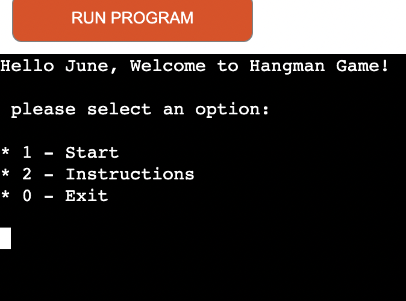

- User will be asked if they want to start game or instruction or exit the game. The user input will validate each time
  and appropriate feedback will be given for invalid data entry. Also the screen will be cleared after long instruction
  and options to choose level will appear after 6seconds
  
  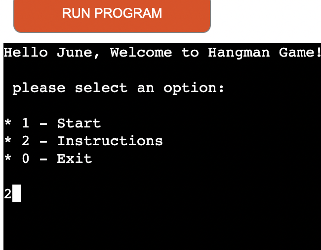
  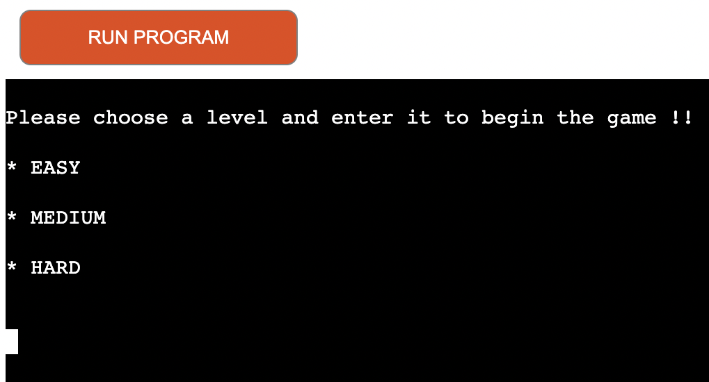
- At the start option the user has to choose
  from three levels such as easy, medium
  and hard. Again the input will validate each time and appropriate feedback will be given for invalid data entry.

  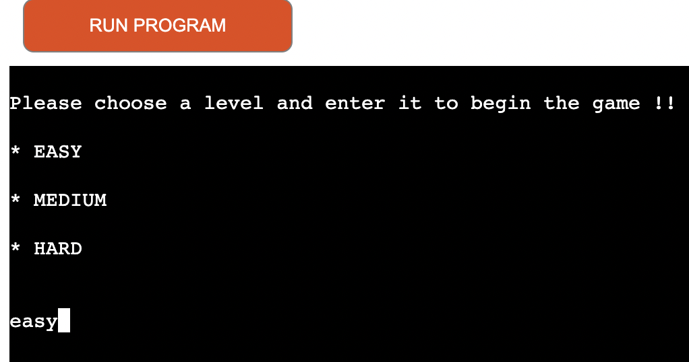

- Word will be selected randomly from the
  preffered level. User is asked to guess the word and enter one alphabet. The 
  underscores and lives will display. These underscores represents the number of letters in the word selected as the answer.  

  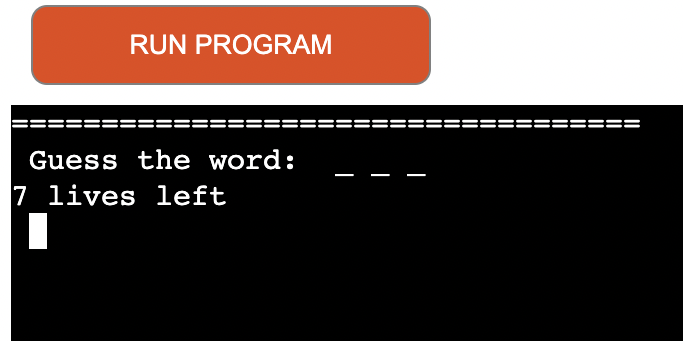

-  If the first input is correct, the letter will replaces the underscore and
   smiling face of graphical representation
   appear and it will show if the user correctly enter all the letters. If the input letter not in the slected word then
   user will loose alife in the game and graphical image of hangman will start to show. In both case user will get notified. After each entry the screen will be clearout and answers will be displayed.

   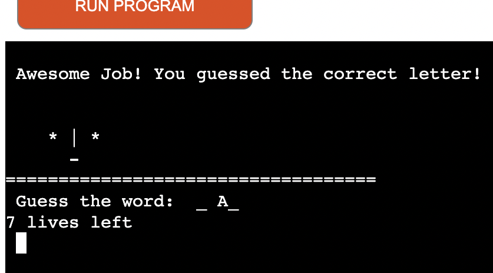

   

   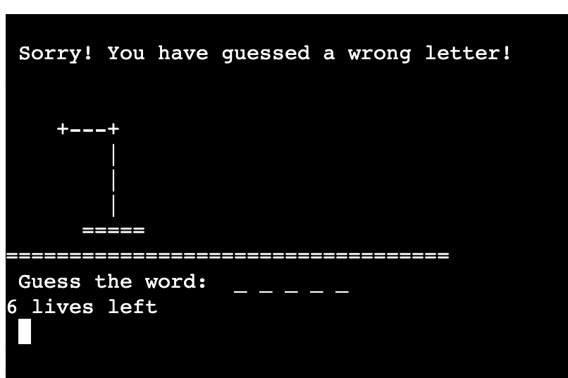
   
     
     - for all incorrect input, that is other than a single alphabet, user will be 
       notified and lives will not be counted.
    
      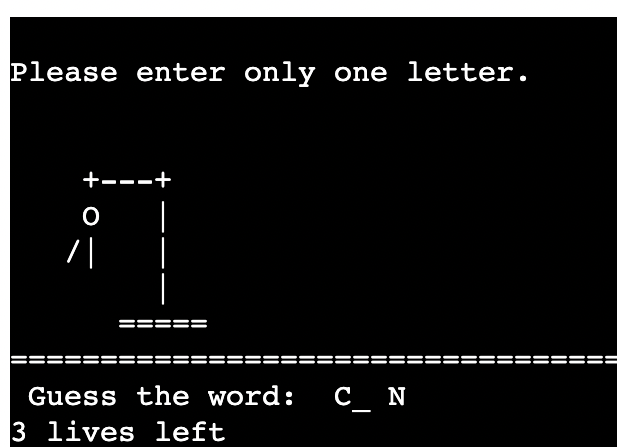

      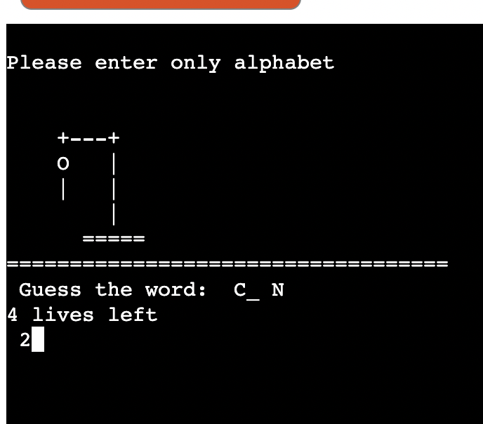

-  Game will be over when the user answer all correct letters  or the hangman
   image completely displays. The user will now be asked if they want to start
   another game or exit.

  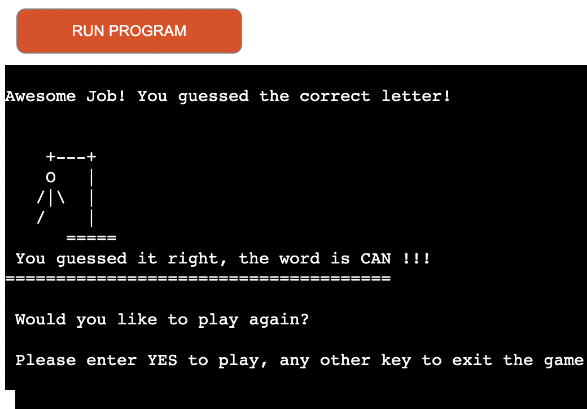

  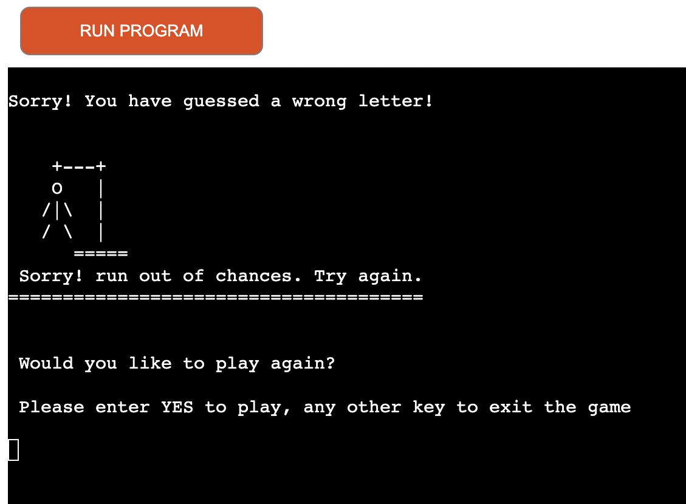

## Technologies Used

Main Language Used
- Python

## Validator Testing

- code validated by PEP8 validator which installed in gitpod
- there is no major errors in the code except 10 warning signs 

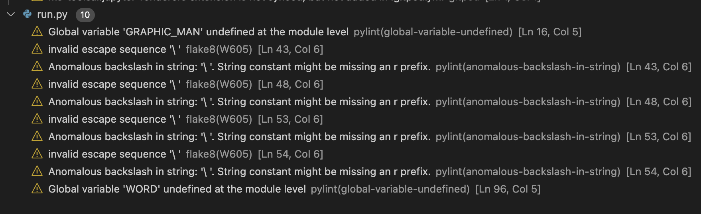

## Manual testing
- Tested navigation works on all stages of the game
- Tested input name function
- Tested option selection
- Tested game level selection
- Tested the complete game, and all the inputs user should put a  
  valid entry.
- Tested on Chrome, and Firefox browser
- Tested on Desktop, Laptop, iPad and mobile phones 

- There is an error in testing the site on safari browser, it is a 
  known issue with emulator and tutor support confirmed the same. 

## Deployment
- The project was created in Github using the Code Institute’s full template
- Github was used for code repository 
 
#### Project deployment steps below

- This project was developed using a GitPod workspace. The code was committed to
  Git and pushed to GitHub using the terminal.
- To deploy this page to Heroku from its GitHub repository, the following steps
   were taken
- Create the Heroku App:
    - Choose Create new app in Heroku
    - enter the project name
    - select Europe as region, then click Create app button.
    - In settings page, choose Buildpack section, choose python and save then choose
      nodejs and save change accordingly.
    - must then create a _Config Var_ called `PORT`. Set this to `8000`  
    - go to deploy page, Connect to GitHub and authorize and in Git Hub repositories
      search for the project and connect.
    - choose  manual deploy or Automatic Deploys.
    - Once the deployment completed click the view bitton to open the project in new
      window

## Forking a Repository
- On GitHub.com, navigate to the octocat/Spoon-Knife repository.
- In the top-right corner of the page, click Fork.
- Select an owner for the forked repository.
- By default, forks are named the same as their parent    
  repositories.
- Optionally, add a description of your fork.  

## Cloning a Repository**
- On GitHub.com, navigate to the main page of the repository.
- Above the list of files, click Code.
- Copy the URL for the repository. 
- Click on HTTP section you will see the http of the repository 
  click on the window next to it it will say copied
- Change the current working directory to the location where you 
  want the cloned directory.

## Unfixed bugs
No unfixed bugs

## Credits and Reference

- W3School  
- README.md of my own project cookbook  <a href="https://myfirst-hangman-game.herokuapp.com/">link</a>
- coding-boot-camp- professional-readme-guide
- Ascii art <a href="https://www.asciiart.eu/">link</a>
- Lucid chart app <a href="https://www.lucidchart.com/pages/">link</a>
- Table of contents generated with markdown-toc <a href='http://ecotrust-canada.github.io/markdown-toc/'>link</a>
- Github docs <a href="https://docs.github.com/en/get-started/quickstart/fork-a-repo#cloning-your-forked-repository">link</a>

## Acknowledgements

- Thanks to my mentor, for the guidence throughout the project.
- Thanks to Cohort Facilitators
