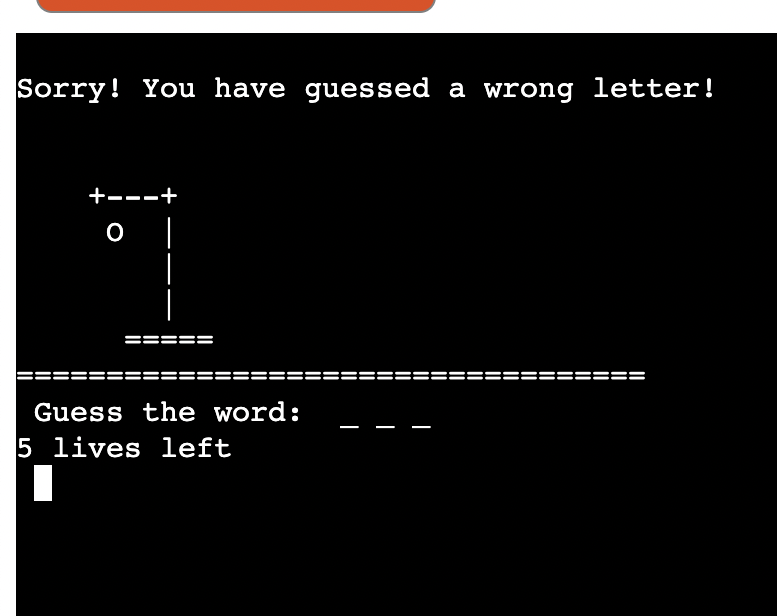

# Hangman Game
Hangman is a word game where the goal is simply to find the missing word or words. 
You will be presented with a number of blank spaces representing the missing letters you need to find.

View live site here! <a href="https://myfirst-hangman-game.herokuapp.com/">link</a>

## UX

#### User Stories
First time users
- As a user I want enjoy playing word game.
- As a user I wants to have clear feedback for their action
- As a user I want to navigate to pages easily 
- As a user I want to play and get appropriate message based on game progress 
- As a user I want the site to be intuitive looking
- As a user I want to know how to select different level of game
- As a user I want to see visual effect of the game 

#### Returning users

- As a returning user of the site, I want to be able to quickly find information about game 
- As a returning user of the site, I want to be able to quickly start the game 

#### Site owner

- As an owner of the site, I want to let people enjoy the game  
- As an owner of the site, I want to give options for different levels of game 
- As an owner of the site, I want the game easily available for new user.
- As an owner of the site, I want to display the game progress for each user input 
- As an owner of the site, I want the game site to be easily navigating and functioning  
 
#### Site structure

If your chosen letter exists in the answer, then all places in the answer where that letter appear will be revealed.

After you've revealed several letters, you may be able to guess what the answer is and fill in the remaining letters.

Be warned, every time you guess a letter wrong you loose a life and the hangman begins to appear, piece by piece.

Solve the puzzle before the hangman dies

- The home page will have a main banner with large ascii art image of main title.
- Use the keyboard to guess a letter
-If your chosen letter exists in the answer, then all places in the answer where that letter appear will be revealed.
- The site will have a navigation menu in the top right, consistent on all pages
- The navigation menu will change to a hamburger menu on mobile and tablet devices 
- The main page will have 4 small images along with taglines to highlight the courses 
- The second page will display images of dishes prepared  by participants,  8 images along with taglines 
- The third page will have a enrollment form and programme selection dropdown. 
 
- All pages will also contain a section at the bottom of the page which includes  social media links
#### Home page
- The home page will contain some introductory text about what the site does and what offer to clients.
 
- There will also be an image with relevant taglines that fits in with the site design.
Students Corner
- The about page will contain images of dishes prepared by students along with taglines
#### Join Us Page
- The contact page will contain an enrollment  form so users can submit their details, the form will require name, phone, email, and programme selection tool. The system will display a thankyou page based on successful submission of enrollment form.

### Strategy
.

## Scope

__Funtional Reqirements__

**Skeleton**
The skeleton wireframe was made to give a clean and easy to use experiance.
Made with Balsamiq

**Structure**
The flowchart made during the planning stage of the project. The detalied flowchart shows the structure of the game plan and it was helpful for the difeerent stages of development of the game.   

Flowchart

## Features

- welcome message with user name
- user can choose from start, instructions or exit
- user can select different level of game
- user can see the graphical representaion of a hangman
  throughout the game 
- user can choose restart the game or exit the game 

- **The site**

- **game plan**
- Upon loading the page, a large logo ascii art displays and asks
  the user to input their name.

    

- It's important to give a input, user can enter any letters. When the user completes
  entering their name, a welcome message with their name appears.
  
  

- User will be asked if they want to start game or instruction or exit the game. The
  user input will validate each time and appropriate feedback will be given for invalid data entry. Also the screen will be cleared after long instruction and options to choose level will appear after 6seconds
  
  
  
- At the start option the user has to choose
  from three levels such as easy, medium
  and hard. Again the input will validate each time and appropriate feedback will be given for invalid data entry.

  

- Word will be selected randomly from the
  preffered level. User is asked to guess the word and enter one alphabet. The 
  underscores and lives will display. These underscores represents the number of letters in the word selected as the answer.  

  

-  If the input is correct, the letter will replaces the
   underscore. If the input letter not in the slected word then user will loose alife in the game. In both case user will get notified. After each entry the screen will be clearout and answers will be displayed

   

   

- 

## Technologies Used

Main Language Used
- Python

## Validator Testing

-  validation links

## Manual testing
- Tested navigation works on all pages including links 
- Tested enrollment form and its functionalities 
- Tested dropdown button functions on enrollment form 
- Tested success message alert when enrollment is completed 
- Tested thank you page is displayed after submitting enrollment form 
- Tested on Chrome, Safari and Firefox browsers
- Tested on Desktop, Laptop, iPad and mobile phones

## Deployment
- The project was created in Github using the Code Institute’s full template
- Github was used for code repository 

 
#### Project deployment steps below

- This project was developed using a GitPod workspace. The code was committed to Git
  and pushed to GitHub using the terminal.
- To deploy this page to Heroku from its GitHub repository, the following steps were
  taken
- Create the Heroku App:
- Choose Create new app in Heroku
- enter the project name
- select Europe as region, then click Create app button.
- In settings page, choose Buildpack section, choose python and save then choose
  nodejs and save change accordingly.
- must then create a _Config Var_ called `PORT`. Set this to `8000`  
- go to deploy page, Connect to GitHub and authorize and in Git Hub repositories
  search for the project and connect.
- choose  manual deploy or Automatic Deploys.
- Once the deployment completed click the view bitton to open the project in new
  window

- 

## Unfixed bugs
No unfixed bugs

## Credits and Reference

- W3School  
- README.md of my own project cookbook  (add link)
- coding-boot-camp- professional-readme-guide

## Acknowledgements

- Thanks to my mentor, for the guidence.
- Thanks to Cohort Facilitators
